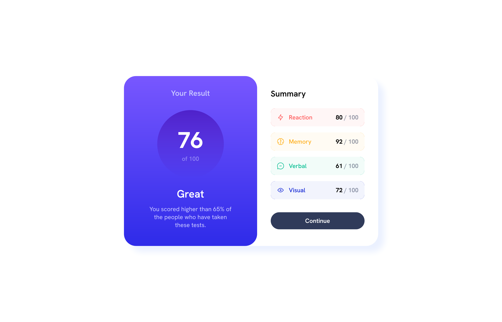

# Frontend Mentor - Results summary component solution

This is a solution to the [Results summary component challenge on Frontend Mentor](https://www.frontendmentor.io/challenges/results-summary-component-CE_K6s0maV). Frontend Mentor challenges help you improve your coding skills by building realistic projects.

## Table of contents

- [Overview](#overview)
  - [The challenge](#the-challenge)
  - [Screenshot](#screenshot)
  - [Links](#links)
- [My process](#my-process)
  - [Built with](#built-with)
  - [What I learned](#what-i-learned)
  - [Continued development](#continued-development)
  - [Useful resources](#useful-resources)
- [Author](#author)
- [Acknowledgments](#acknowledgments)

## Overview

### The challenge

Users should be able to:

- View the optimal layout for the interface depending on their device's screen size
- See hover and focus states for all interactive elements on the page
- **Bonus**: Use the local JSON data to dynamically populate the content

### Screenshot



### Links

- [Solution](https://github.com/Sephydev/result-summary-component)
- [Live Site](https://sephydev.github.io/result-summary-component/)

## My process

### Built with

- Semantic HTML5 markup
- CSS custom properties
- Flexbox
- JavaScript Asynchronous Function
- Mobile-first workflow

### What I learned

During this project, I learn how to use data from json data with JavaScript, and how I can make corners-only border with the help of div and css.

This HTML snippet is the code I wrote before I get the data from the JSON file. It shows the multiple div I used to make the corners-only border.

```html
<div class="container">
  <div class="corner top-left red-corner"></div>
  <div class="corner top-right red-corner"></div>
  <div class="corner bottom-right red-corner"></div>
  <div class="corner bottom-left red-corner"></div>
  <div class="reaction-container category-container">
    <div class="category-title-container">
      
      <p class="reaction-title category-title">Reaction</p>
    </div>
    <p class="category-score">80 <span class="total-score">/ 100</span></p>
  </div>
</div>
```

This CSS snippet is only a part of the code used for making the corners-only border.

```css
.bottom-left {
  bottom: 0;
  left: 0;
  border-radius: 0 0 0 1rem;
  border-bottom: 1px solid;
  border-left: 1px solid;
}

.corner {
  position: absolute;
  background: none;
  height: 0.75rem;
  width: 0.75rem;
  opacity: 0.2;
}
```

This JavaScript snipper shows how I made the corners-only border using Javascript instead of HTML.

```js
const topLeftCorner = document.createElement("div");
topLeftCorner.classList.add(
  "corner",
  "top-left",
  data[i].category.toLowerCase() + "-corner"
);
const topRightCorner = document.createElement("div");
topRightCorner.classList.add(
  "corner",
  "top-right",
  data[i].category.toLowerCase() + "-corner"
);
const bottomRightCorner = document.createElement("div");
bottomRightCorner.classList.add(
  "corner",
  "bottom-right",
  data[i].category.toLowerCase() + "-corner"
);
const bottomLeftCorner = document.createElement("div");
bottomLeftCorner.classList.add(
  "corner",
  "bottom-left",
  data[i].category.toLowerCase() + "-corner"
);

categoryContainer.appendChild(topLeftCorner);
categoryContainer.appendChild(topRightCorner);
categoryContainer.appendChild(bottomRightCorner);
categoryContainer.appendChild(bottomLeftCorner);
```

### Continued development

Even if I really need to improve for getting data in JSON File and making piece of ui like corners-only border, it was fun to do it in this project. I will try to train on those domain on future project.

### Useful resources

- [Medium Article on how to connect HTML and JSON File with JavaScript](https://dizzpy.medium.com/how-to-connect-html-with-json-using-javascript-a-beginners-guide-25e94306fa0f) - This helped me a lot while I was connecting the JSON file and the HTML File

## Author

- Frontend Mentor - [@Sephydev](https://www.frontendmentor.io/profile/Sephydev)

## Acknowledgments

I want to thanks the Frontend Mentor team for making beautiful challenges to train with.
I also want to thanks the Medium team for the useful article who helped me during this project.
